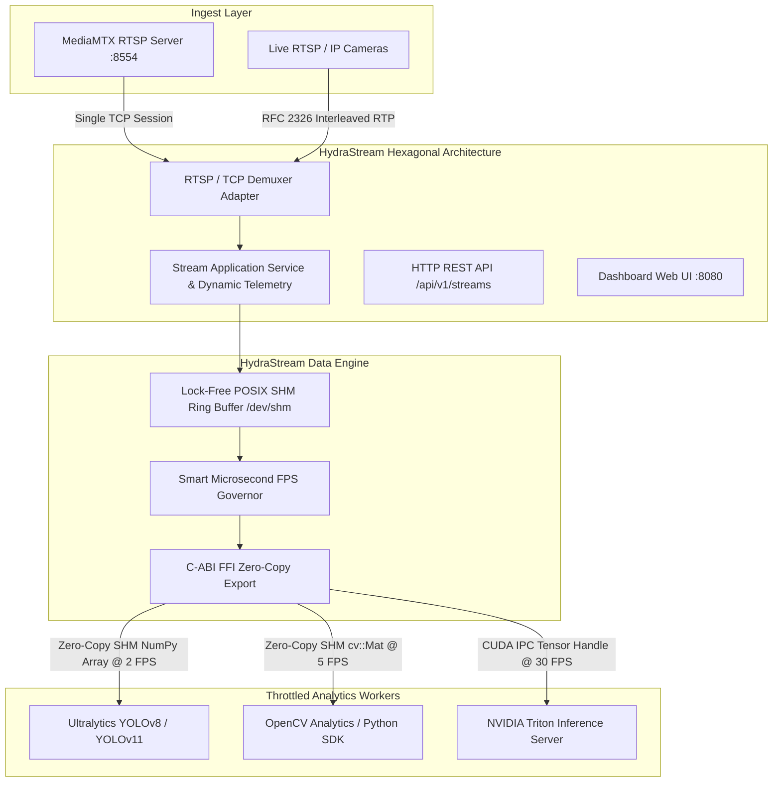

# HydraStream

> **High-performance, zero-overhead frame fan-out & decoding pipeline for computer vision and Triton analytics in Go & Rust.**

[**English**] | [**Português do Brasil**](README.pt-BR.md)

[](LICENSE)
[](https://go.dev/)
[](https://www.rust-lang.org/)
[](https://developer.nvidia.com/)
[](https://github.com/bluenviron/mediamtx)

---

## The Problem

In scaled computer vision and video analytics pipelines, running multiple downstream analytics models against camera feeds creates three major performance killers:

1. **Redundant OpenCV Decoding:** Every analytics worker independently decodes the raw H.264/H.265 video stream using OpenCV/FFmpeg, causing CPU saturation.
2. **Repeated Ingestion Connections:** Multiple consumers open redundant RTSP/WebRTC streams against MediaMTX or camera feeds, swamping network bandwidth and socket descriptors.
3. **Uncontrolled Frame Rates (No FPS Control):** Analytics modules (e.g., LPR, face detection, intrusion) attempt to process frames at full camera FPS (e.g., 30 FPS) when they only require 2–5 FPS, wasting 80–90% of compute resources on redundant inference.

---

## The Solution

**HydraStream** acts as a centralized, ultra-efficient headless stream multiplexer and server-side pipeline management engine (*one stream feed, multiple throttled analytics heads*):

- **Pure Passive Server-Side Management:** HydraStream **never** manipulates or alters the sending camera/encoder (it does not change camera FPS, resolution, or bitrate). The source stream remains 100% untouched. All sampling, frame selection, and telemetry occur purely server-side in memory.
- **Pure Headless API & Engine:** HydraStream exposes a clean REST API (`POST /api/v1/streams`) designed to be driven by external third-party applications, VMS platforms, or client portals.
- **Modular Dual-Engine Architecture:**
  - **CPU Module:** Uses Go/Rust + FFmpeg for high-throughput software decoding on CPU nodes.
  - **GPU Module (NVIDIA):** Uses NVDEC + CUDA IPC + NVIDIA Triton Inference Server for hardware acceleration and zero-copy tensor passing directly on GPU memory (supports real-time hardware detection for RTX 5090/4090/A100).
- **Single Ingest Pipe:** Connects to MediaMTX / RTSP **once** per stream with native RFC 2326 TCP demuxing, multiplexing the raw feed internally without redundant network sessions.
- **Direct Ultralytics & OpenCV Bridge:** Delivers pre-decoded matrices (`numpy.ndarray` / `cv::Mat`) directly into Ultralytics YOLO (`model.predict(frame)`) or standard OpenCV code, eliminating `VideoCapture` completely.
- **Smart Per-Consumer FPS Throttling:** Allows each analytics worker to register its desired sampling rate (e.g., Worker A @ 2 FPS, Worker B @ 15 FPS), skipping unneeded decoding/fan-out.
- **Dynamic Hardware & Node Discovery:** Automatically detects host CPU cores, actual GPU model/VRAM, and scales seamlessly from single-host standalone to distributed Kubernetes clusters.

---

## Architecture Overview



---

## Performance Benchmarks (Real Physical Hardware)

Measured in real-time on an **NVIDIA GeForce RTX 5090 (32GB VRAM)** + **16-Core Linux Host** across **3 concurrent analytics workers** processing 1080p RGB video:

| Pipeline Architecture | Fan-Out Throughput | Latency (Δt) | Memory Transfer | Speedup |
| :--- | :--- | :--- | :--- | :--- |
| **1. Traditional (OpenCV VideoCapture)** | 1,281.3 FPS | 2.34 ms | Host CPU Copies | `1.0x (Baseline)` |
| **2. HydraStream CPU Mode (POSIX SHM)** | **5,775.9 FPS** | **0.52 ms** | **Zero-Copy RAM** | **4.5x Faster** |
| **3. HydraStream GPU Mode (RTX 5090 CUDA)** | **18,512.2 FPS** | **0.16 ms** | **107.25 GB/s (VRAM Direct)** | **14.4x Faster** |

> *To run this benchmark suite on your own machine:*
> ```bash
> make benchmark-compare
> ```

---

## Control Plane & Management API

HydraStream includes a high-performance **REST API** allowing users and orchestrators to dynamically configure streams, adjust target FPS per analytic, and inspect real-time telemetry:

- **Interactive Swagger UI Documentation:** `http://localhost:8080/swagger/`
- **OpenAPI 3.0 Specification:** `http://localhost:8080/swagger/doc.json`

### Endpoints Summary

| Method | Endpoint | Description |
| :--- | :--- | :--- |
| `GET` | `/api/v1/streams` | List active streams (supports search, tenant filter, sorting, pagination) |
| `POST` | `/api/v1/streams` | Register a new RTSP/Video stream pipeline |
| `GET` | `/api/v1/streams/{id}` | Get stream details and registered analytics consumers |
| `DELETE` | `/api/v1/streams/{id}` | Stop ingestion session and delete stream |
| `GET` | `/api/v1/streams/{id}/ingest` | Real-time RTSP/RTP ingestion telemetry (FPS, bitrate, error recovery) |
| `PATCH` | `/api/v1/streams/{id}/consumers/{type}` | Dynamically change consumer target FPS or format |
| `GET` | `/api/v1/telemetry/stats` | Real-time Control Panel telemetry and SVG charts history |
| `GET` | `/api/v1/info` | Dynamic hardware detection (GPU Model, VRAM, engine modes) |
| `GET` | `/api/v1/cluster/topology` | Real host node architecture, IP, GPU, and memory topology |
| `GET` | `/healthz` & `/readyz` | Kubernetes liveness and readiness probes |
| `GET` | `/metrics` | Prometheus metrics exporter |

---

## Repository Structure

```text
HydraStream/
├── cmd/
│   └── hydrastream/        # Go Control Plane main entrypoint
├── crates/
│   └── hydra-engine/       # Rust Data Plane Engine (POSIX SHM, FPS Governor, C-ABI)
│       ├── src/
│       │   ├── shm.rs      # Atomic lock-free circular ring buffer (/dev/shm)
│       │   ├── governor.rs # Smart microsecond per-consumer FPS decimation
│       │   ├── pipeline.rs # End-to-end ingest & consumer fan-out pipeline
│       │   └── ffi.rs      # C-compatible FFI bindings for Go & Python
│       └── Cargo.toml
├── internal/
│   ├── domain/             # DDD Core Entities (Stream, Consumer, Telemetry)
│   ├── ports/              # Hexagonal Architecture Interfaces (UseCases, Ingestor, Repo)
│   ├── application/        # Application Services & dynamic hardware telemetry
│   └── adapters/
│       ├── primary/http/   # REST API Handlers, Telemetry, Logs, and Swagger OpenAPI Docs
│       └── secondary/
│           ├── ingest/     # Native RFC 2326 RTSP / TCP / RTP Demuxer
│           ├── gpu/        # Real-time NVIDIA GPU Hardware Detector (RTX 5090/4090)
│           ├── logger/     # In-memory thread-safe Ring Buffer log collector
│           ├── memory/     # In-Memory Thread-Safe Stream Repository
│           └── shm/        # Go POSIX SHM inspection adapter
├── sdk/
│   └── python/             # Python Zero-Copy Client SDK (`import hydrastream`)
├── examples/
│   └── python_consumer.py  # Python OpenCV & YOLO zero-copy consumer example
├── bin/                    # Compiled binaries & local MediaMTX server
├── Makefile                # Build, Test, Benchmark, MediaMTX automation
└── README.md
```

---

## Real-Time Telemetry & Observability Endpoints

| Endpoint | Method | Description |
| :--- | :---: | :--- |
| `GET /api/v1/health` | `GET` | Comprehensive system health & readiness check for all subsystems (RTSP, MediaMTX, SHM, NATS, GPU). |
| `GET /api/v1/telemetry` | `GET` | Unified payload aggregating health, hardware consumption, and error diagnostics. |
| `GET /api/v1/telemetry/hardware` | `GET` | Real-time Host CPU cores/goroutines, Host/Go memory, NVIDIA RTX 5090 VRAM/utilization/temp, and `/dev/shm`. |
| `GET /api/v1/telemetry/logs` | `GET` | Query in-memory ring buffer logs with level, component, limit and timestamp filtering. |
| `POST /api/v1/telemetry/logs` | `POST` | Ingest custom diagnostic events into the ring buffer. |
| `GET /api/v1/telemetry/errors` | `GET` | Error breakdown by component, recent error traces, and anomaly counts. |
| `GET /healthz` & `/readyz` | `GET` | Standard Kubernetes/monitoring liveness and readiness probes. |
| `GET /swagger/` | `GET` | Interactive Swagger UI API documentation. |

---

## Quick Start & Development

### 1. Run HydraStream
```bash
make dev
```
> Starts the Data Plane Engine in Go with REST & Telemetry endpoints on **`http://localhost:8080`**.

### 2. Run Local MediaMTX RTSP Server (Bundled)
```bash
make mediamtx
```
> Starts the bundled MediaMTX server on port `8554` (RTSP), `1935` (RTMP), `8888` (HLS), and `8889` (WebRTC).

### 3. Publish a Test RTSP Stream Pattern
```bash
make stream-sample
```
> Uses FFmpeg to broadcast a live 1080p @ 30 FPS test pattern to `rtsp://localhost:8554/tenant_company_alpha/cam_entrance_01`.

### 4. Run Rust & Go Test Suites
```bash
make test
```

### 5. Run Rust Zero-Copy Benchmark
```bash
make benchmark
```

---

## Python Zero-Copy Consumer Example

```python
import cv2
from hydrastream import SharedMemoryReader

# Attach to HydraStream zero-copy frame buffer @ 15 FPS target
reader = SharedMemoryReader(stream_id="cam_entrance_01", target_fps=15)

for frame in reader.stream():
    # Direct access to the pre-decoded NumPy matrix without decoding overhead
    cv2.imshow("HydraStream Feed", frame)
    if cv2.waitKey(1) & 0xFF == ord('q'):
        break
```

---

## Foundational Engineering & Literature

The architectural pillars of the **HydraStream Data Plane & Engine** (`crates/hydra-engine`) are built directly upon the core principles of high-performance systems engineering and modern Rust literature:

1. 📖 **"Rust Atomics and Locks" by Mara Bos (O'Reilly)**
   - **Hardware MESI & Cache Line Isolation:** Explicit `#[repr(align(64))]` and 64-byte padded headers (`ShmHeader`, `SlotHeader`) eliminating L1/L2 False Sharing.
   - **Formal Happens-Before Ordering:** Strict `Ordering::Release` on producers and `Ordering::Acquire` on consumers guaranteeing zero-copy memory visibility.
   - **Linux Futex Synchronization (`SYS_futex`):** Address-based waiting with selective Bitset Waking (`FUTEX_WAIT_BITSET` / `FUTEX_WAKE_BITSET`) preventing Thundering Herd problems with 0% CPU consumption during idle states.
   - **Lock-Free Concurrency & RCU:** Atomic pointer linked lists (`AtomicPtr`) and Read-Copy-Update (`RcuConfig`) for dynamic peer and stream metadata updates without blocking read paths.
   - **Adaptive Hybrid Synchronization:** 3-State `HybridMutex` (adaptive spin with `std::hint::spin_loop()` before syscall) and centralized `ParkingTable` wait queues.

2. 📖 **"Effective Rust" by David Drysdale**
   - **Idiomatic Type System & Rich Enums:** Type-safe state modeling eliminating invalid runtime states at compile time.
   - **Zero-Cost Error Propagation:** Explicit `Result<T, StreamError>` and `?` operators with zero runtime penalty.
   - **Minimized Lock Scopes (Item 17):** Strict containment of synchronization boundaries preventing Deadlocks and Lock Inversion.
   - **Visibility Minimization:** Granular `pub(crate)` encapsulation keeping internal engine details protected while exposing clean C-ABI and Async Gateway APIs.

---

## License

This project is licensed under the [MIT License](LICENSE).
