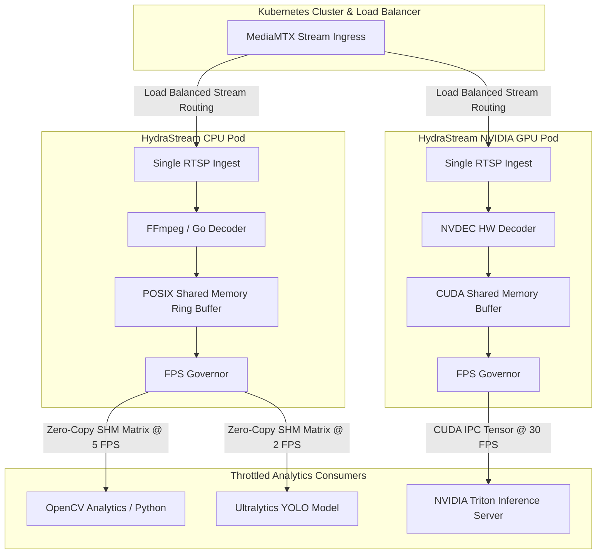
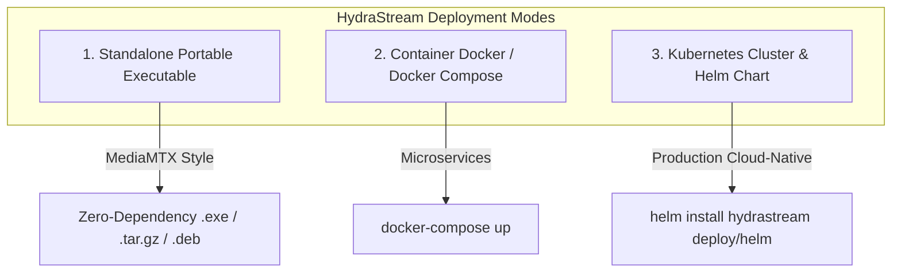
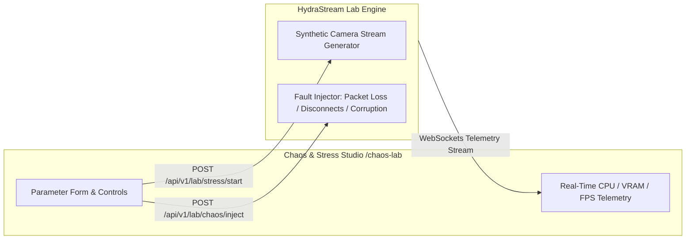

# HydraStream

> **High-performance, zero-overhead frame fan-out & decoding pipeline for computer vision and Triton analytics in Go & Rust.**

[ **English** ] | [ **Português do Brasil** ](README.pt-BR.md)

[](LICENSE)
[](https://go.dev/)
[](https://www.rust-lang.org/)
[](https://developer.nvidia.com/nvidia-triton-inference-server)
[](https://github.com/bluenviron/mediamtx)

---

## The Problem

In scaled computer vision and video analytics pipelines, running multiple downstream analytics models against camera feeds creates three major performance killers:

1. **Redundant OpenCV Decoding:** Every analytics worker independently decodes the raw H.264/H.265 video stream using OpenCV/FFmpeg, causing CPU saturation.
2. **Repeated Ingestion Connections:** Multiple consumers open redundant RTSP/WebRTC streams against MediaMTX or camera feeds, swamping network bandwidth and socket descriptors.
3. **Uncontrolled Frame Rates (No FPS Control):** Analytics modules (e.g., LPR, face detection, intrusion) attempt to process frames at full camera FPS (e.g., 30 FPS) when they only require 2–5 FPS, wasting 80–90% of compute resources on redundant inference.

---

## The Solution

**HydraStream** acts as a centralized, ultra-efficient headless stream multiplexer and server-side pipeline management engine (*one stream feed, multiple throttled analytics heads*):

- **Pure Passive Server-Side Management:** HydraStream **never** manipulates or alters the sending camera/encoder (it does not change camera FPS, resolution, or bitrate). The source stream remains 100% untouched. All sampling, frame selection, and telemetry occur purely server-side in memory.
- **Pure Headless API & Engine:** HydraStream does not manage camera user databases natively. Instead, it exposes a clean REST/gRPC API (`POST /api/v1/streams`) designed to be driven by external third-party applications, VMS platforms, or client portals.
- **Modular Dual-Engine Architecture:**
  - **CPU Module:** Uses Go/Rust + FFmpeg for high-throughput software decoding on CPU nodes.
  - **GPU Module (NVIDIA):** Uses NVDEC + CUDA IPC + NVIDIA Triton Inference Server for hardware acceleration and zero-copy tensor passing directly on GPU memory.
- **Single Ingest Pipe:** Connects to MediaMTX / RTSP **once** per stream, multiplexing the raw feed internally without redundant network sessions.
- **Direct Ultralytics & OpenCV Bridge:** Delivers pre-decoded matrices (`numpy.ndarray` / `cv::Mat`) directly into Ultralytics YOLO (`model.predict(frame)`) or standard OpenCV code, eliminating `VideoCapture` completely.
- **Smart Per-Consumer FPS Throttling:** Allows each analytics worker to register its desired sampling rate (e.g., Worker A @ 2 FPS, Worker B @ 15 FPS), skipping unneeded decoding/fan-out.
- **Kubernetes-Native & Load Balanced:** Designed to run in Kubernetes clusters with stream sharding and load balancing across worker pods.

---

## Architecture Overview



---

## Why HydraStream vs. NVIDIA DeepStream

| Feature | NVIDIA DeepStream | HydraStream |
| :--- | :--- | :--- |
| **Docker Image Size** | Heavy (12 GB to 20 GB) | Ultra-lightweight (< 80 MB CPU / ~500 MB GPU) |
| **Hardware Support** | NVIDIA GPUs Only (Vendor Lock-in) | Hybrid Universal (CPU, Intel OpenVINO, AMD, NVIDIA GPU) |
| **Development Complexity** | Complex C/GStreamer plugin pipeline | Simple Python SDK, NumPy, OpenCV, and REST API |
| **Kubernetes Pod Startup** | Slow (minutes to pull 15 GB image) | Instant (< 3 seconds image pull & startup) |
| **Memory Footprint** | Heavy GStreamer memory graphs | Lock-free Rust POSIX Shared Memory Zero-Copy |

---

## Key Features

- **Dual Decoding Engine (CPU / GPU):** Run on lightweight CPU instances or scale up with NVIDIA GPUs (NVDEC + Triton).
- **Bypasses OpenCV `VideoCapture`:** Feeds pre-decoded frame matrices straight into **Ultralytics YOLO** (`yolov8`/`yolov11`) and OpenCV scripts.
- **Cloud-Native & Kubernetes Ready:** Easily deployable via Helm, supporting Pod auto-scaling and stream partition load balancing.
- **Single-Connection Ingestion:** Eliminates redundant RTSP connections to MediaMTX per camera stream.
- **Smart Per-Analytic FPS Governor:** Dynamically samples frames per consumer demand (e.g. 2 FPS vs 30 FPS), dropping unneeded processing instantly.
- **Zero-Copy Shared Memory (SHM & CUDA IPC):** Publish decoded raw matrices directly into POSIX shared memory or GPU VRAM for microsecond latency.
- **Native Triton Inference Integration:** Direct tensor streaming to NVIDIA Triton Inference Server without CPU-GPU host copies.

---

## Supported Input Media Sources

HydraStream ingests a wide range of input media sources beyond live IP cameras:

1. **Live Media Streams (Continuous Feed):**
   - **RTSP:** `rtsp://ip:554/stream` (IP Cameras, ONVIF discovery)
   - **RTMP:** `rtmp://server/live/stream` (Live broadcasts, OBS Studio)
   - **WebRTC / WHIP:** Ultra-low latency web stream ingestion
   - **SRT & HLS:** Secure Reliable Transport & HTTP Live Streaming
2. **Video Files (Looping Virtual Camera):**
   - **`.mp4` / `.mkv` / `.avi` / `.mov`:** Ingest local or network video files looped continuously as a virtual camera (ideal for offline analytics benchmarking).
3. **Image Sequences & Directories:**
   - **Static Image Files (`.jpg` / `.png`):** Single frame matrix ingestion.
   - **Image Directory Sequence Watcher:** Ingest a folder of image files (`/path/to/frames/*.jpg`) sequentially as a video feed at a configured FPS.

---

## Tech Stack

| Component | Technology | Purpose |
| :--- | :--- | :--- |
| **Media Stream Server** | [MediaMTX](https://github.com/bluenviron/mediamtx) | Ingestion of RTSP, RTMP, WebRTC, HLS streams |
| **Core Engine** | Go & Rust | High-concurrency stream orchestration and safe native memory management |
| **CPU Decoding** | FFmpeg / Go / Rust | High-throughput CPU decoding |
| **GPU Decoding** | NVIDIA NVDEC / CUDA IPC | Zero-copy GPU hardware decoding & tensor allocation |
| **Inference Engine** | NVIDIA Triton / Ultralytics YOLO | GPU/CPU accelerated AI model inference |
| **Orchestration** | Kubernetes & Helm | Stream load balancing and autoscaling across cluster nodes |
| **Consumer Output** | OpenCV (`cv::Mat`) / NumPy | Direct consumption by analytics scripts |

---

## Control Plane & Management API

HydraStream includes a high-performance **REST & gRPC Management API** allowing users and orchestrators (e.g. Kubernetes controllers) to dynamically configure streams, adjust target FPS per analytic, and select output delivery modes on the fly.

- **Interactive Swagger UI Documentation:** `http://localhost:8080/swagger/`
- **OpenAPI 3.0 Specification:** `http://localhost:8080/swagger/doc.json`

### 1. Register Stream & Configure Consumer Pipeline (`POST /api/v1/streams`)

Supports **Multi-Tenancy Isolation** with `tenant_id` namespacing across POSIX SHM, MediaMTX paths, Redis keys, and Prometheus metrics:

```json
{
  "tenant_id": "tenant_company_alpha",
  "stream_id": "cam_entrance_01",
  "source_url": "rtsp://mediamtx:8554/tenant_company_alpha/cam_entrance_01",
  "decoding_engine": "nvidia_nvdec",
  "consumers": [
    {
      "analytic_type": "lpr_ocr",
      "target_fps": 2.0,
      "output_format": "shm_numpy",
      "shm_key": "/hs_shm_tenant_company_alpha_cam_entrance_01_lpr"
    },
    {
      "analytic_type": "object_tracker",
      "target_fps": 15.0,
      "output_format": "cuda_ipc_tensor",
      "cuda_device_id": 0
    },
    {
      "analytic_type": "triton_inference",
      "target_fps": 5.0,
      "output_format": "triton_grpc",
      "triton_model_name": "yolov8_ensemble"
    }
  ]
}
```

### 2. Dynamically Update Analytic FPS or Output (`PATCH /api/v1/streams/{stream_id}/consumers/{analytic_type}`)

```bash
# Dynamically scale LPR analytics FPS from 2 to 5 FPS during peak hours
curl -X PATCH http://localhost:8080/api/v1/streams/cam_entrance_01/consumers/lpr_ocr \
  -H "Content-Type: application/json" \
  -d '{"target_fps": 5.0, "output_format": "shm_numpy"}'
```

### 3. On-Demand Snapshots (`.jpg`) & Live Web Stream (`.mjpeg`)

- **Single JPEG Snapshot (`GET /api/v1/streams/{stream_id}/snapshot.jpg`):**
  Encodes the latest raw frame directly from the POSIX SHM ring buffer to JPEG in memory via Rust (zero impact on video stream decoding performance).
  ```bash
  curl -o snapshot.jpg http://localhost:8080/api/v1/streams/cam_entrance_01/snapshot.jpg
  ```

- **Live MJPEG Web Stream (`GET /api/v1/streams/{stream_id}/mjpeg`):**
  Streams continuous JPEG frames over a single HTTP connection. Directly embeddable in any HTML page with **zero JavaScript**:
  ```html
  <!-- Zero-JS Live Video Preview in Web UI -->
  
  ```

### 4. Comprehensive Stream Telemetry & Stats (`GET /api/v1/streams/{stream_id}/stats`)

```json
{
  "stream_id": "cam_entrance_01",
  "status": "online",
  "resolution": "1920x1080",
  "codec": "h264",
  "ingest_fps": 30.0,
  "decode_latency_ms": 1.42,
  "hardware_decoder": "NVDEC (GPU 0)",
  "shm_occupancy_percent": 12.5,
  "consumers": [
    {
      "analytic_type": "lpr_ocr",
      "target_fps": 2.0,
      "actual_fps": 2.0,
      "dropped_frames": 0,
      "output_format": "shm_numpy"
    },
    {
      "analytic_type": "object_tracker",
      "target_fps": 15.0,
      "actual_fps": 14.98,
      "dropped_frames": 2,
      "output_format": "cuda_ipc_tensor"
    }
  ]
}
```

### 5. Cluster Hardware & Topology Discovery (`GET /api/v1/cluster/topology`)

Exposes real-time Kubernetes node mapping, CPU models, NVIDIA GPU assignments, and consumer transport paths:

```json
{
  "stream_id": "cam_entrance_01",
  "ingestion_node": {
    "node_name": "k8s-gpu-node-02",
    "node_ip": "10.0.1.45",
    "cpu_architecture": "AMD EPYC 7763 64-Core",
    "gpu_hardware": "NVIDIA A100-SXM4-80GB",
    "decoder_engine": "NVDEC (GPU 0)"
  },
  "consumer_routing": [
    {
      "analytic": "yolo_detection",
      "target_node": "k8s-gpu-node-02",
      "same_node": true,
      "transport_used": "CUDA_IPC (Zero-Copy VRAM Direct)",
      "target_hardware": "NVIDIA A100-SXM4-80GB"
    },
    {
      "analytic": "lpr_ocr",
      "target_node": "k8s-cpu-node-08",
      "same_node": false,
      "transport_used": "gRPC_COMPRESSED_STREAM",
      "target_hardware": "Intel Xeon Gold 6330 (CPU Worker)"
    }
  ]
}
```

### 6. Kubernetes Observability & Health Probes

- `GET /healthz` - Liveness probe
- `GET /readyz` - Readiness probe (verifies MediaMTX & SHM subsystem readiness)
- `GET /metrics` - Prometheus metrics exporter (Ingest FPS, Consumer FPS, decode latency, SHM drops)

### Supported Output Formats:

| Output Format | Description | Target Use Case |
| :--- | :--- | :--- |
| `shm_numpy` / `shm_mat` | POSIX Shared Memory zero-copy raw matrix | OpenCV Python / C++ workers on same host/pod |
| `cuda_ipc_tensor` | Zero-copy CUDA GPU memory pointer | NVIDIA Triton / PyTorch on same GPU node |
| `triton_grpc` | Direct gRPC Tensor payload pushing | Remote Triton Inference Server cluster |
| `redis_stream` | Frame matrix/snapshot publishing via Redis Streams | Distributed multi-server microservices & worker queues |
| `nats_pubsub` | High-throughput frame publishing via NATS JetStream | Low-latency pub/sub event-driven cloud architecture |
| `snapshot_jpg` | On-demand single JPEG snapshot image | API integrations, alerts, static image dumps |
| `mjpeg_stream` | Low-overhead zero-JS MJPEG video stream (``) | Web UI dashboards & live camera previews |

---

## Repository Structure

```text
HydraStream/
├── cmd/
│   └── hydrastream/        # Go Engine Entrypoint & Control Plane REST/gRPC API
├── internal/
│   ├── api/                # REST/gRPC HTTP Handlers & WebSockets Telemetry
│   ├── k8s/                # Kubernetes Client-Go Operator & Topology Mapper
│   └── mediamtx/           # MediaMTX REST Client & Session Multiplexer
├── core_rust/              # Rust Native Data Plane Engine (NVDEC, FFmpeg, SHM)
│   ├── src/
│   │   ├── decoder.rs      # NVDEC CUDA / FFmpeg C-FFI Binding
│   │   ├── shm_ring.rs     # POSIX Shared Memory Lock-Free Circular Buffer
│   │   └── governor.rs     # Per-Consumer FPS Decimator
│   └── Cargo.toml
├── sdk/
│   └── python/             # Python Client SDK (pip installable: hydrastream-python)
├── web/                    # Dashboard UI & Chaos Lab Studio (/chaos-lab)
├── deploy/
│   ├── docker/             # Dockerfile & 1-Click docker-compose.yml
│   └── helm/               # Production Kubernetes Helm Chart (DaemonSet + HPA)
├── Makefile                # Build, Test, Stress, and Chaos targets
└── README.md
```

---

## Cross-Platform Distribution & Deployment Modes

HydraStream supports **three flexible deployment modes** using the exact same core engine:



1. **Standalone Portable Executable (MediaMTX Style):**
   - **Embedded Web UI (`//go:embed`):** Web Dashboard UI, CSS, JS, and `/chaos-lab` assets are statically compiled *inside* the single executable file.
   - Simply download `hydrastream.zip` (Windows) or `hydrastream.tar.gz` (Linux/macOS), extract, and run `./hydrastream`.

2. **Container Mode (Docker & Docker Compose):**
   - Official Multi-Arch Docker Container (`ghcr.io/your_user/hydrastream:latest`).
   - `docker-compose.yml` stack bringing up MediaMTX, HydraStream, Mock RTSP Camera Generator, and Prometheus/Grafana.

3. **Kubernetes Cloud-Native Mode (Helm Chart):**
   - Production Helm Chart (`deploy/helm/hydrastream`) with DaemonSet support, Shared Memory volume mounts (`emptyDir: medium: Memory`), and Horizontal Pod Autoscaling (HPA).

| Platform / OS | Single Portable Binary | Distribution Archive | Deployment Mode |
| :--- | :--- | :--- | :--- |
| **Linux (64-bit / ARM64)** | `hydrastream` | `hydrastream_v1.0_linux_amd64.tar.gz` | Zero-dependency standalone binary / `systemd` |
| **Windows 10/11 / Server** | `hydrastream.exe` | `hydrastream_v1.0_windows_amd64.zip` | Zero-dependency standalone `.exe` |
| **macOS (Apple Silicon / Intel)** | `hydrastream` | `hydrastream_v1.0_darwin_arm64.tar.gz` | Zero-dependency standalone binary |
| **Linux Packages (`.deb` / `.rpm`)** | `hydrastream` | `.deb` / `.rpm` installers | System-managed package |
| **Kubernetes / Docker** | `hydrastream` | Docker Multi-Arch Container | Cloud-Native Pod / Helm Release |

---

## Quick Start & 1-Click Local Dev

### 1-Click Docker Compose Stack

Spin up MediaMTX + HydraStream Engine + Mock RTSP Camera Generator + Web UI + Prometheus/Grafana with a single command:

```bash
# Clone the repository
git clone https://github.com/YOUR_USERNAME/HydraStream.git
cd HydraStream

# Start the full development stack
docker-compose up -d
```

### Installing the Python SDK

```bash
pip install hydrastream-python
```

### Python OpenCV Consumer Example (Zero-Copy SHM)

```python
import cv2
from hydrastream import SharedMemoryReader

# Attach to HydraStream zero-copy frame buffer @ 15 FPS target
reader = SharedMemoryReader(stream_id="cam_01", target_fps=15)

while True:
    # Zero-copy reference to the latest decoded OpenCV matrix
    frame = reader.get_latest_frame()
    if frame is None:
        continue
    
    # Process frame with OpenCV without decoding CPU overhead
    cv2.imshow("HydraStream Feed", frame)
    if cv2.waitKey(1) & 0xFF == ord('q'):
        break
```

### Python Ultralytics YOLO Example (Zero-Copy, No VideoCapture)

```python
from ultralytics import YOLO
from hydrastream import SharedMemoryReader

# Load YOLO model
model = YOLO("yolov8n.pt")

# Connect to HydraStream stream reader @ 5 FPS target (bypasses OpenCV VideoCapture)
reader = SharedMemoryReader(stream_id="cam_01", target_fps=5)

while True:
    # Fetch pre-decoded frame matrix directly from Shared Memory
    frame = reader.get_latest_frame()
    if frame is None:
        continue

    # Direct inference on pre-decoded NumPy matrix
    results = model.predict(source=frame, verbose=False)
    print(f"Detected {len(results[0].boxes)} objects")
```

---

## Fault Tolerance & Resilience Guarantees

HydraStream is built for zero-downtime mission-critical video analytics pipelines:

1. **Zero-Impact Consumer Isolation:**
   - Consumers map POSIX Shared Memory using `PROT_READ` (Read-Only).
   - If an analytics script (Python/OpenCV/Ultralytics) crashes, freezes, or throws an exception, the core HydraStream decoder engine and other connected analytics remain 100% unaffected.
2. **Camera Disconnect & Reconnect Handling:**
   - Automatic RTSP reconnection with **Exponential Backoff**.
   - During camera outages, HydraStream injects a synthetic **"No Signal / Camera Offline"** placeholder frame into the ring buffer header, allowing consumers to maintain steady loop execution without blocking or crashing.
3. **Lock-Free Buffer Integrity:**
   - Ring buffers utilize lock-free atomic head/tail pointers. Slow consumers automatically drop outdated frames without causing backpressure on upstream video decoding.

---

## Testing, Stress & Chaos Engineering Suite

HydraStream includes native CLI tooling and a dedicated **Web Chaos Lab (`/chaos-lab`)** to test lock-free concurrency, simulate massive scale, and inject real-time faults into video streams:

```bash
# Run unit & concurrency tests (Go & Rust lock-free SHM tests)
make test

# Run multi-camera stress test (Simulates 50+ RTSP cameras via synthetic FFmpeg feeds)
make stress-test

# Run Chaos Engineering Suite (Injects packet loss, corrupted NAL units, and abrupt RTSP disconnects)
make chaos-test
```

### Chaos & Stress Lab Web UI (`/chaos-lab`)

The HydraStream Web Dashboard includes an interactive **Chaos & Stress Testing Studio**:



#### Interactive Controls & Parameters:

- **Stress Testing Sliders:**
  - `Simulated Cameras`: Scale dynamically from 1 to 200 RTSP camera streams.
  - `Stream Resolution & FPS`: Toggle 720p, 1080p, 4K @ 15/30/60 FPS.
  - `Simulated Consumers`: Spawn 1 to 20 Python OpenCV/YOLO workers per camera.
- **Chaos Injection Toggles:**
  - `Network Packet Loss Rate (%)`: Simulate 0% to 50% loss on RTSP stream sockets.
  - `Abrupt Stream Disconnects`: Trigger random camera socket drops every N seconds.
  - `Corrupted NAL Units`: Inject damaged H.264/H.265 frames to test NVDEC/FFmpeg recovery.
  - `Consumer Process SIGKILL`: Simulate random Python analytics crashes to verify `PROT_READ` SHM buffer isolation.

---

## Roadmap

- [ ] **Phase 1:** Core Rust/Go RTSP stream ingest & FFmpeg software matrix decoder.
- [ ] **Phase 2:** POSIX Shared Memory (SHM) ring buffer implementation for zero-copy IPC.
- [ ] **Phase 3:** MediaMTX pipeline integration and `.mp4` / image directory watcher.
- [ ] **Phase 4:** NVDEC / CUDA IPC acceleration for direct GPU memory transfer to NVIDIA Triton Inference Server.
- [ ] **Phase 5:** Python C-extension / C++ SDK for seamless `cv::Mat` binding.
- [ ] **Phase 6:** Chaos engineering suite and multi-node Kubernetes DaemonSet Helm Chart.

---

## License

This project is licensed under the [MIT License](LICENSE).
