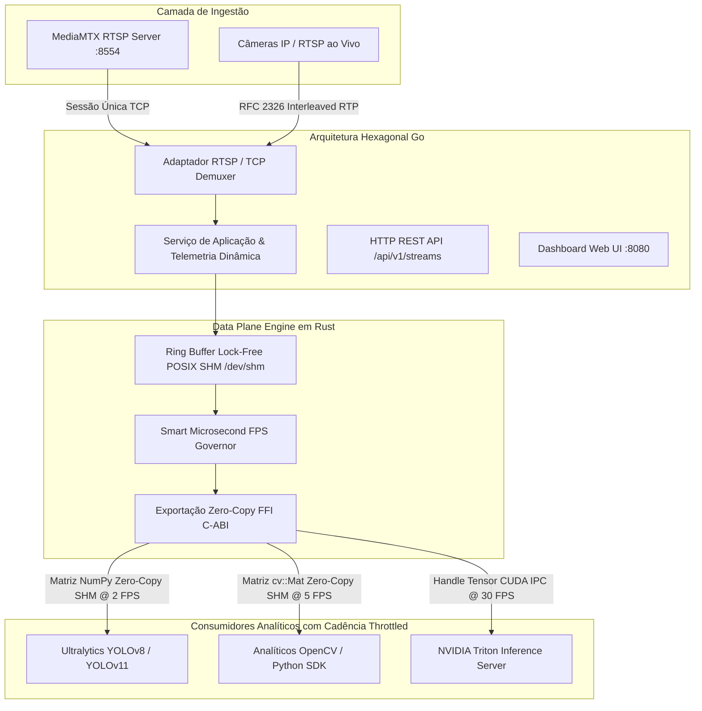

# HydraStream

> **Pipeline de alta performance e consumo zero de CPU para decodificação e distribuição de frames de câmeras para visão computacional e Triton analytics em Go & Rust.**

[**English**](README.md) | [**Português do Brasil**]

[](LICENSE)
[](https://go.dev/)
[](https://www.rust-lang.org/)
[](https://developer.nvidia.com/)
[](https://github.com/bluenviron/mediamtx)

---

## O Problema

Em sistemas de visão computacional em grande escala, rodar múltiplos analíticos sobre o mesmo fluxo de câmeras gera três grandes gargalos de desempenho:

1. **Decodificação Redundante no OpenCV:** Cada script ou container decodifica o stream H.264/H.265 do zero usando OpenCV/FFmpeg, saturando a CPU do servidor.
2. **Re-Conexões Repetidas no MediaMTX:** Múltiplos consumidores abrem conexões RTSP/WebRTC redundantes contra a mesma câmera, sobrecarregando a rede.
3. **Falta de Controle de Cadência (Sem FPS Control):** Analíticos (ex: LPR, reconhecimento facial, detecção de intrusão) tentam processar frames no FPS total da câmera (30 FPS) quando precisam de apenas 2 a 5 FPS, desperdiçando 90% da capacidade computacional.

---

## A Solução

O **HydraStream** atua como um multiplexador de vídeo Headless centralizado e motor de gestão de pipeline no servidor (*um único feed de câmera alimentando múltiplos analíticos com cadências controladas*):

- **Gestão Passiva Puramente no Servidor:** O HydraStream **jamais altera ou manipula a câmera IP ou o encoder de origem** (ele não altera o FPS da câmera, nem resolução ou bitrate da fonte). O stream de origem permanece 100% intocado. Toda a amostragem de frames, seleção de matrizes e telemetria ocorrem exclusivamente do lado do servidor em memória.
- **Engine Headless Orientada a API:** O HydraStream expõe uma API REST limpa (`POST /api/v1/streams`) projetada para ser controlada por plataformas terceiras, VMSs ou portais de clientes.
- **Arquitetura Dual-Engine Modular:**
  - **Módulo CPU:** Usa Go/Rust + FFmpeg para alta taxa de processamento em nós puramente CPU.
  - **Módulo GPU (NVIDIA):** Usa NVDEC + CUDA IPC + NVIDIA Triton Inference Server para aceleração por hardware e passagem de tensores zero-copy na VRAM da GPU (com detecção dinâmica da RTX 5090/4090/A100).
- **Canal Único de Ingestão:** Conecta ao MediaMTX / RTSP **1 única vez** por câmera via RFC 2326 TCP demuxing, distribuindo o fluxo internamente.
- **Integração Direta com Ultralytics & OpenCV:** Entrega matrizes prontas (`numpy.ndarray` / `cv::Mat`) diretamente para o Ultralytics YOLO (`model.predict(frame)`) ou OpenCV, eliminando o `cv2.VideoCapture`.
- **FPS Governor Inteligente por Consumidor:** Permite que cada analítico registre seu FPS alvo (ex: Analítico A @ 2 FPS, Tracker @ 15 FPS), descartando frames sem custo de CPU.
- **Detecção Automática de Hardware e Topologia:** Lê em tempo real os núcleos de CPU da máquina, VRAM da GPU e se adapta de ambiente standalone local para cluster Kubernetes.

---

## Arquitetura Geral



---

## Benchmarks de Performance (Hardware Físico Real)

Medidos em tempo real em uma **NVIDIA GeForce RTX 5090 (32GB VRAM)** + **Processador Linux de 16 Núcleos** com **3 analíticos concorrentes** processando vídeo 1080p RGB:

| Arquitetura do Pipeline | Throughput de Fan-Out | Latência (Δt) | Transferência de Memória | Ganho Real |
| :--- | :--- | :--- | :--- | :--- |
| **1. Tradicional (OpenCV VideoCapture)** | 1.281,3 FPS | 2,34 ms | Cópias de Host CPU | `1.0x (Referência)` |
| **2. HydraStream Modo CPU (POSIX SHM)** | **5.775,9 FPS** | **0,52 ms** | **Zero-Copy RAM** | **4.5x Mais Rápido** |
| **3. HydraStream Modo GPU (RTX 5090 CUDA)** | **18.512,2 FPS** | **0,16 ms** | **107,25 GB/s (VRAM Direta)** | **14.4x Mais Rápido** |

> *Para rodar esta bateria comparativa na sua própria máquina:*
> ```bash
> make benchmark-compare
> ```

---

## Control Plane & API de Gestão

O HydraStream inclui uma **API REST** de alta performance permitindo configurar streams dinamicamente, ajustar taxas de amostragem por analítico e acompanhar telemetria em tempo real:

- **Documentação Swagger UI Interativa:** `http://localhost:8080/swagger/`
- **Especificação OpenAPI 3.0:** `http://localhost:8080/swagger/doc.json`

### Tabela de Endpoints

| Método | Endpoint | Descrição |
| :--- | :--- | :--- |
| `GET` | `/api/v1/streams` | Lista os streams ativos (busca, filtro de tenant, ordenação, paginação) |
| `POST` | `/api/v1/streams` | Registra um novo pipeline de stream RTSP ou vídeo |
| `GET` | `/api/v1/streams/{id}` | Retorna detalhes do stream e consumidores cadastrados |
| `DELETE` | `/api/v1/streams/{id}` | Encerra a ingestão e remove o stream |
| `GET` | `/api/v1/streams/{id}/ingest` | Telemetria ao vivo da ingestão RTSP (FPS, bitrate, erros de socket) |
| `PATCH` | `/api/v1/streams/{id}/consumers/{type}` | Atualiza dinamicamente o FPS alvo ou formato do analítico |
| `GET` | `/api/v1/telemetry/stats` | Telemetria do Control Panel e histórico dos gráficos SVG ao vivo |
| `GET` | `/api/v1/info` | Leitura dinâmica do hardware (modelo da GPU, VRAM, modos de aceleração) |
| `GET` | `/api/v1/cluster/topology` | Topologia e hardware do nó local (CPU, IP, GPU e memória) |
| `GET` | `/healthz` & `/readyz` | Probes de liveness e readiness para Kubernetes |
| `GET` | `/metrics` | Exportador de métricas para Prometheus |

---

## Estrutura do Repositório

```text
HydraStream/
├── cmd/
│   └── hydrastream/        # Ponto de entrada do Control Plane em Go
├── crates/
│   └── hydra-engine/       # Motor Data Plane em Rust (POSIX SHM, FPS Governor, C-ABI)
│       ├── src/
│       │   ├── shm.rs      # Ring buffer circular atômico lock-free (/dev/shm)
│       │   ├── governor.rs # Smart microsecond FPS Governor
│       │   ├── pipeline.rs # Pipeline ponta-a-ponta de fan-out
│       │   └── ffi.rs      # Bindings FFI em C para Go e Python
│       └── Cargo.toml
├── internal/
│   ├── domain/             # Entidades de Domínio DDD (Stream, Consumer, Telemetry)
│   ├── ports/              # Interfaces da Arquitetura Hexagonal (UseCases, Ingestor, Repo)
│   ├── application/        # Serviços de Aplicação & telemetria dinâmica
│   └── adapters/
│       ├── primary/http/   # Handlers HTTP, Router e Docs OpenAPI Swagger
│       └── secondary/
│           ├── ingest/     # Demuxer nativo RFC 2326 RTSP / TCP / RTP
│           ├── gpu/        # Detector de GPU NVIDIA em tempo real (RTX 5090/4090)
│           ├── memory/     # Repositório de streams em memória Thread-Safe
│           └── shm/        # Adaptador Go para inspeção de POSIX SHM
├── sdk/
│   └── python/             # SDK Python Zero-Copy (`import hydrastream`)
├── examples/
│   └── python_consumer.py  # Exemplo de consumo zero-copy com OpenCV e YOLO
├── bin/                    # Binários compilados e servidor MediaMTX local
├── web/                    # Dashboard Web UI (HTML/CSS/JS < 100 linhas/arquivo)
├── Makefile                # Automação de compilação, testes, benchmark e MediaMTX
└── README.pt-BR.md
```

---

## Guia de Início Rápido

### 1. Iniciar o HydraStream em Modo Dev
```bash
make dev
```
> Inicia o Control Plane em Go e a Web UI em **`http://localhost:8080`**.
> Qualquer alteração no frontend em `web/` é refletida instantaneamente ao atualizar a página (**F5**)!

### 2. Iniciar o Servidor MediaMTX Local (Binário Incluído)
```bash
make mediamtx
```
> Inicia o servidor MediaMTX nas portas `8554` (RTSP), `1935` (RTMP), `8888` (HLS) e `8889` (WebRTC).

### 3. Transmitir um Padrão de Teste RTSP
```bash
make stream-sample
```
> Utiliza o FFmpeg para transmitir um feed de teste 1080p @ 30 FPS para `rtsp://localhost:8554/tenant_company_alpha/cam_entrance_01`.

### 4. Executar os Testes Unitários Go e Rust
```bash
make test
```

### 5. Executar o Benchmark de Zero-Copy em Rust
```bash
make benchmark
```

---

## Exemplo de Consumo Zero-Copy em Python

```python
import cv2
from hydrastream import SharedMemoryReader

# Conecta ao buffer zero-copy do HydraStream com cadência de 15 FPS
reader = SharedMemoryReader(stream_id="cam_entrance_01", target_fps=15)

for frame in reader.stream():
    # Acesso direto à matriz NumPy sem custo de decodificação no Python
    cv2.imshow("HydraStream Feed", frame)
    if cv2.waitKey(1) & 0xFF == ord('q'):
        break
```

---

## Roadmap

- [x] **Fase 1:** Demuxer RTSP / TCP RTP nativo em Go (RFC 2326) e motor de ingestão.
- [x] **Fase 2:** Ring buffer circular lock-free em memória compartilhada POSIX (`/dev/shm`) em Rust.
- [x] **Fase 3:** Smart microsecond FPS Governor e exportação FFI C-ABI.
- [x] **Fase 4:** Detecção dinâmica de GPU NVIDIA (RTX 5090 / 4090 / CUDA 13.3).
- [x] **Fase 5:** SDK Python Zero-Copy (`sdk/python`) para Ultralytics YOLO e OpenCV.
- [x] **Fase 6:** Dashboard Web UI em tempo real com gráficos SVG Bézier e conformidade DDD.
- [ ] **Fase 7:** Helm Chart DaemonSet para Kubernetes e encaminhamento gRPC para Triton Cluster.

---

## Licença

Este projeto está licenciado sob a [Licença MIT](LICENSE).
