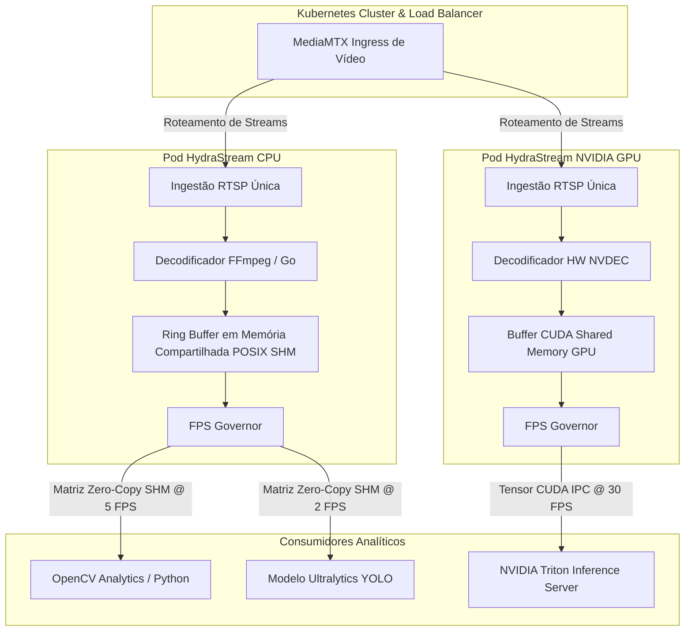
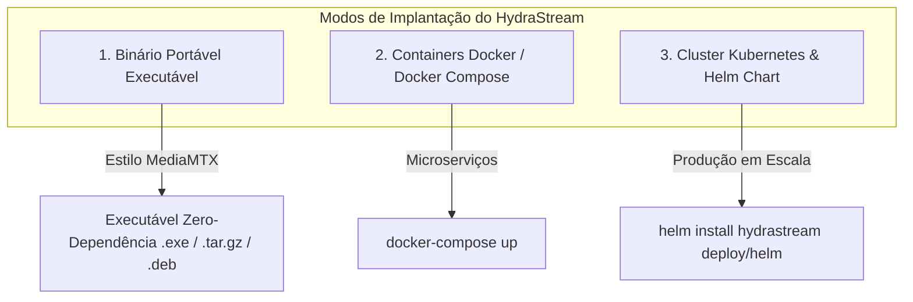
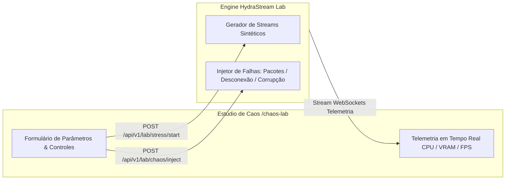

# HydraStream

> **Pipeline de alta performance e consumo zero de CPU para decodificação e distribuição de frames de câmeras para visão computacional e Triton analytics em Go & Rust.**

[ **English** ](README.md) | [ **Português do Brasil** ]

[](LICENSE)
[](https://go.dev/)
[](https://www.rust-lang.org/)
[](https://developer.nvidia.com/nvidia-triton-inference-server)
[](https://github.com/bluenviron/mediamtx)

---

## O Problema

Em sistemas de visão computacional em grande escala, rodar múltiplos analíticos sobre o mesmo fluxo de câmeras gera três grandes gargalos de desempenho:

1. **Decodificação Redundante no OpenCV:** Cada script ou container decodifica o stream H.264/H.265 do zero usando OpenCV/FFmpeg, saturando a CPU do servidor.
2. **Re-Conexões Repetidas no MediaMTX:** Múltiplos consumidores abrem conexões RTSP/WebRTC redundantes contra a mesma câmera, sobrecarregando a rede.
3. **Falta de Controle de Cadência (Sem FPS Control):** Analíticos (ex: LPR, reconhecimento facial, detecção de intrusão) tentam processar frames no FPS total da câmera (30 FPS) quando precisam de apenas 2 a 5 FPS, desperdiçando 90% da capacidade computacional.

---

## A Solução

O **HydraStream** atua como um multiplexador de vídeo Headless centralizado e motor de memória (*um único feed de câmera alimentando múltiplos analíticos com cadências controladas*):

- **Engine Headless Orientada a API:** O HydraStream não armazena cadastro de usuários ou câmeras de forma nativa. Em vez disso, ele expõe uma API REST/gRPC limpa (`POST /api/v1/streams`) projetada para ser controlada por plataformas terceiras, VMSs ou portais de clientes.
- **Arquitetura Dual-Engine Modular:**
  - **Módulo CPU:** Usa Go/Rust + FFmpeg para alta taxa de processamento em nós puramente CPU.
  - **Módulo GPU (NVIDIA):** Usa NVDEC + CUDA IPC + NVIDIA Triton Inference Server para aceleração por hardware e passagem de tensores zero-copy na VRAM da GPU.
- **Canal Único de Ingestão:** Conecta ao MediaMTX / RTSP **1 única vez** por câmera, distribuindo o fluxo internamente.
- **Integração Direta com Ultralytics & OpenCV:** Entrega matrizes prontas (`numpy.ndarray` / `cv::Mat`) diretamente para o Ultralytics YOLO (`model.predict(frame)`) ou OpenCV, eliminando o `cv2.VideoCapture`.
- **FPS Governor Inteligente por Consumidor:** Permite que cada analítico registre seu FPS alvo (ex: Analítico A @ 2 FPS, Tracker @ 15 FPS), descartando frames sem custo de CPU.
- **Nativo para Kubernetes & Load Balanced:** Projetado para rodar em clusters Kubernetes com particionamento de streams e balanceamento de carga.

---

## Arquitetura Geral



---

## Por que HydraStream vs. NVIDIA DeepStream

| Recurso | NVIDIA DeepStream | HydraStream |
| :--- | :--- | :--- |
| **Tamanho da Imagem Docker** | Pesada (12 GB a 20 GB) | Ultra Leve (< 80 MB em CPU / ~500 MB em GPU) |
| **Suporte a Hardware** | Apenas GPUs NVIDIA (Lock-in) | Híbrido Universal (CPU, Intel OpenVINO, AMD, NVIDIA GPU) |
| **Complexidade de Código** | Pipelines complexos em C/GStreamer | Python SDK simples, NumPy, OpenCV e REST API |
| **Inicialização no Kubernetes** | Lenta (minutos para baixar imagem de 15 GB) | Instantânea (< 3 segundos para baixar e subir o Pod) |
| **Pegada de Memória** | Gráficos de memória GStreamer pesados | Ring Buffer POSIX Shared Memory Zero-Copy em Rust |

---

## Recursos Principais

- **Motor Duplo de Decodificação (CPU / GPU):** Roda em instâncias CPU leves ou escala com GPUs NVIDIA (NVDEC + Triton).
- **Bypass do OpenCV `VideoCapture`:** Alimenta matrizes de imagem diretamente no **Ultralytics YOLO** (`yolov8`/`yolov11`) e scripts OpenCV.
- **Cloud-Native & Kubernetes Ready:** Implantação simples via Helm Chart, suporte a auto-scaling (HPA) e DaemonSet.
- **Ingestão com Conexão Única:** Elimina conexões RTSP redundantes com o MediaMTX por câmera.
- **FPS Governor Inteligente:** Amostragem dinâmica de frames por demanda do consumidor (ex: 2 FPS vs 30 FPS), descartando processamento desnecessário.
- **Memória Compartilhada Zero-Copy (SHM & CUDA IPC):** Publica matrizes brutas diretamente na RAM POSIX ou VRAM da GPU com latência em microssegundos.
- **Integração Nativa com Triton Inference:** Streaming direto de tensores para o NVIDIA Triton Inference Server sem cópia Host-Device.

---

## Stack Tecnológica

| Componente | Tecnologia | Propósito |
| :--- | :--- | :--- |
| **Servidor de Mídia** | [MediaMTX](https://github.com/bluenviron/mediamtx) | Ingestão de streams RTSP, RTMP, WebRTC, HLS |
| **Motor Core** | Go & Rust | Orquestração de alta concorrência e gerenciamento seguro de memória bruta |
| **Decodificação CPU** | FFmpeg / Go / Rust | Decodificação de alto rendimento em CPU |
| **Decodificação GPU** | NVIDIA NVDEC / CUDA IPC | Decodificação por hardware GPU e alocação zero-copy de tensores |
| **Motor de Inferência** | NVIDIA Triton / Ultralytics YOLO | Inferência acelerada por GPU/CPU |
| **Orquestração** | Kubernetes & Helm | Balanceamento de carga de streams e auto-scaling |
| **Saída Consumidor** | OpenCV (`cv::Mat`) / NumPy | Consumo direto por scripts analíticos |

---

## Control Plane & API de Gerenciamento

O HydraStream inclui uma **API REST & gRPC de Alta Performance** permitindo que usuários e orquestradores (controllers Kubernetes) configurem streams dinamicamente, ajustem o FPS por analítico e escolham os formatos de saída em tempo real.

- **Documentação Interativa Swagger UI:** `http://localhost:8080/swagger/`
- **Especificação OpenAPI 3.0:** `http://localhost:8080/swagger/doc.json`

### 1. Cadastrar Stream & Configurar Pipeline (`POST /api/v1/streams`)

Suporta **Isolamento Multi-Tenant** com namespaces por `tenant_id` na memória SHM, rotas MediaMTX, chaves Redis e métricas Prometheus:

```json
{
  "tenant_id": "empresa_alpha",
  "stream_id": "cam_portaria_01",
  "source_url": "rtsp://mediamtx:8554/empresa_alpha/cam_portaria_01",
  "decoding_engine": "nvidia_nvdec",
  "consumers": [
    {
      "analytic_type": "lpr_ocr",
      "target_fps": 2.0,
      "output_format": "shm_numpy",
      "shm_key": "/hs_shm_empresa_alpha_cam_portaria_01_lpr"
    },
    {
      "analytic_type": "object_tracker",
      "target_fps": 15.0,
      "output_format": "cuda_ipc_tensor",
      "cuda_device_id": 0
    },
    {
      "analytic_type": "triton_inference",
      "target_fps": 5.0,
      "output_format": "triton_grpc",
      "triton_model_name": "yolov8_ensemble"
    }
  ]
}
```

### 2. Alterar FPS ou Saída em Tempo Real (`PATCH /api/v1/streams/{stream_id}/consumers/{analytic_type}`)

```bash
# Altera o FPS do analítico de LPR de 2 para 5 FPS em horário de pico
curl -X PATCH http://localhost:8080/api/v1/streams/cam_portaria_01/consumers/lpr_ocr \
  -H "Content-Type: application/json" \
  -d '{"target_fps": 5.0, "output_format": "shm_numpy"}'
```

### 3. Snapshots Sob Demanda (`.jpg`) & Live Stream Web (`.mjpeg`)

- **Snapshot Único JPEG (`GET /api/v1/streams/{stream_id}/snapshot.jpg`):**
  Codifica a matriz mais recente da SHM para JPEG em memória via Rust (impacto zero na decodificação do vídeo).
  ```bash
  curl -o snapshot.jpg http://localhost:8080/api/v1/streams/cam_portaria_01/snapshot.jpg
  ```

- **Stream Ao Vivo MJPEG (`GET /api/v1/streams/{stream_id}/mjpeg`):**
  Transmite frames JPEG contínuos em uma única conexão HTTP. Incorporável em qualquer página HTML com **Zero JavaScript**:
  ```html
  <!-- Preview ao Vivo em HTML sem JavaScript -->
  
  ```

### 4. Telemetria Detalhada & Status (`GET /api/v1/streams/{stream_id}/stats`)

```json
{
  "stream_id": "cam_portaria_01",
  "status": "online",
  "resolution": "1920x1080",
  "codec": "h264",
  "ingest_fps": 30.0,
  "decode_latency_ms": 1.42,
  "hardware_decoder": "NVDEC (GPU 0)",
  "shm_occupancy_percent": 12.5,
  "consumers": [
    {
      "analytic_type": "lpr_ocr",
      "target_fps": 2.0,
      "actual_fps": 2.0,
      "dropped_frames": 0,
      "output_format": "shm_numpy"
    },
    {
      "analytic_type": "object_tracker",
      "target_fps": 15.0,
      "actual_fps": 14.98,
      "dropped_frames": 2,
      "output_format": "cuda_ipc_tensor"
    }
  ]
}
```

### 5. Descoberta de Topologia de Hardware & Cluster (`GET /api/v1/cluster/topology`)

Exibe o mapeamento em tempo real dos Nós do Kubernetes, modelos de CPU, GPUs NVIDIA alocadas e tipo de transporte:

```json
{
  "stream_id": "cam_portaria_01",
  "ingestion_node": {
    "node_name": "k8s-gpu-node-02",
    "node_ip": "10.0.1.45",
    "cpu_architecture": "AMD EPYC 7763 64-Core",
    "gpu_hardware": "NVIDIA A100-SXM4-80GB",
    "decoder_engine": "NVDEC (GPU 0)"
  },
  "consumer_routing": [
    {
      "analytic": "yolo_detection",
      "target_node": "k8s-gpu-node-02",
      "same_node": true,
      "transport_used": "CUDA_IPC (Zero-Copy VRAM Direct)",
      "target_hardware": "NVIDIA A100-SXM4-80GB"
    },
    {
      "analytic": "lpr_ocr",
      "target_node": "k8s-cpu-node-08",
      "same_node": false,
      "transport_used": "gRPC_COMPRESSED_STREAM",
      "target_hardware": "Intel Xeon Gold 6330 (CPU Worker)"
    }
  ]
}
```

### 6. Observabilidade & Probes de Saúde Kubernetes

- `GET /healthz` - Probe de Liveness
- `GET /readyz` - Probe de Readiness (Valida subsistema MediaMTX & SHM)
- `GET /metrics` - Exporter de métricas Prometheus

### Formatos de Saída Suportados:

| Formato de Saída | Descrição | Caso de Uso Recomendado |
| :--- | :--- | :--- |
| `shm_numpy` / `shm_mat` | Matriz raw zero-copy via POSIX Shared Memory | Workers OpenCV Python / C++ no mesmo servidor |
| `cuda_ipc_tensor` | Ponteiro de memória GPU CUDA zero-copy | NVIDIA Triton / PyTorch na mesma GPU |
| `triton_grpc` | Envio direto de tensores via gRPC | Cluster remoto do NVIDIA Triton Inference Server |
| `redis_stream` | Publicação de frames/snapshots via Redis Streams | Microserviços distribuídos em múltiplos servidores |
| `nats_pubsub` | Publicação de altíssimo rendimento via NATS JetStream | Arquitetura Cloud orientada a eventos |
| `snapshot_jpg` | Snapshot estático JPEG sob demanda | Integrações de API, alertas, dumps de imagens |
| `mjpeg_stream` | Stream de vídeo MJPEG leve sem JS (``) | Dashboards web & visualização ao vivo |

---

## Estrutura do Repositório

```text
HydraStream/
├── cmd/
│   └── hydrastream/        # Entrypoint da Engine em Go & API REST/gRPC
├── internal/
│   ├── api/                # Handlers REST/gRPC & Telemetria WebSockets
│   ├── k8s/                # Operator Client-Go & Mapeador de Topologia
│   └── mediamtx/           # Cliente REST MediaMTX & Multiplexador
├── core_rust/              # Engine Nativa em Rust (NVDEC, FFmpeg, SHM)
│   ├── src/
│   │   ├── decoder.rs      # Bindings C-FFI NVDEC CUDA / FFmpeg
│   │   ├── shm_ring.rs     # Ring Buffer Lock-Free em Memória Compartilhada
│   │   └── governor.rs     # FPS Decimator por Consumidor
│   └── Cargo.toml
├── sdk/
│   └── python/             # SDK Python (instalável via pip: hydrastream-python)
├── web/                    # Dashboard UI & Studio Chaos Lab (/chaos-lab)
├── deploy/
│   ├── docker/             # Dockerfile & docker-compose.yml 1-Click
│   └── helm/               # Helm Chart para Kubernetes (DaemonSet + HPA)
├── Makefile                # Targets make test, make stress-test, e make chaos-test
└── README.md
```

---

## Modos de Distribuição Multiplataforma & Implantação

O HydraStream suporta **três modos flexíveis de implantação** reutilizando o mesmo motor:



1. **Executável Portável Standalone (Estilo MediaMTX):**
   - **Interface Web Embutida (`//go:embed`):** Web Dashboard UI, CSS, JS e `/chaos-lab` são compilados *dentro* do próprio executável.
   - Baixe o `hydrastream.zip` (Windows) ou `hydrastream.tar.gz` (Linux/macOS), descompacte e execute `./hydrastream`.

2. **Modo Container (Docker & Docker Compose):**
   - Imagem Docker oficial Multi-Arch (`ghcr.io/seu_usuario/hydrastream:latest`).
   - Stack `docker-compose.yml` subindo MediaMTX, HydraStream, Gerador de Câmeras e Prometheus/Grafana.

3. **Modo Kubernetes Cloud-Native (Helm Chart):**
   - Helm Chart oficial (`deploy/helm/hydrastream`) com suporte a DaemonSet, volumes de memória RAM (`emptyDir: medium: Memory`) e auto-scaling HPA.

| Plataforma / OS | Executável Portável | Pacote de Distribuição | Modo de Implantação |
| :--- | :--- | :--- | :--- |
| **Linux (64-bit / ARM64)** | `hydrastream` | `hydrastream_v1.0_linux_amd64.tar.gz` | Binário portável zero-dependência / `systemd` |
| **Windows 10/11 / Server** | `hydrastream.exe` | `hydrastream_v1.0_windows_amd64.zip` | Executável `.exe` portável |
| **macOS (Apple Silicon / Intel)** | `hydrastream` | `hydrastream_v1.0_darwin_arm64.tar.gz` | Binário portável zero-dependência |
| **Pacotes Linux (`.deb` / `.rpm`)** | `hydrastream` | Instaladores `.deb` / `.rpm` | Pacote gerenciado pelo sistema |
| **Kubernetes / Docker** | `hydrastream` | Container Docker Multi-Arch | Pod Cloud-Native / Helm Release |

---

## Inicio Rápido & Ambiente Local 1-Click

### Stack Docker Compose 1-Click

Suba o MediaMTX + HydraStream + Gerador de Câmeras RTSP + Web UI + Prometheus/Grafana com 1 único comando:

```bash
# Clona o repositório
git clone https://github.com/SEU_USUARIO/HydraStream.git
cd HydraStream

# Inicia a stack completa de desenvolvimento
docker-compose up -d
```

### Instalando o SDK Python

```bash
pip install hydrastream-python
```

### Exemplo Consumidor Python OpenCV (Zero-Copy SHM)

```python
import cv2
from hydrastream import SharedMemoryReader

# Conecta ao buffer zero-copy do HydraStream pedindo 15 FPS
reader = SharedMemoryReader(stream_id="cam_01", target_fps=15)

while True:
    # Referência zero-copy da matriz mais recente
    frame = reader.get_latest_frame()
    if frame is None:
        continue
    
    # Processa o frame no OpenCV sem gasto de decodificação de CPU
    cv2.imshow("HydraStream Feed", frame)
    if cv2.waitKey(1) & 0xFF == ord('q'):
        break
```

### Exemplo Consumidor Python Ultralytics YOLO (Zero-Copy, sem VideoCapture)

```python
from ultralytics import YOLO
from hydrastream import SharedMemoryReader

# Carrega o modelo YOLO
model = YOLO("yolov8n.pt")

# Conecta ao reader do HydraStream pedindo 5 FPS (bypassa cv2.VideoCapture)
reader = SharedMemoryReader(stream_id="cam_01", target_fps=5)

while True:
    # Pega a matriz decodificada diretamente da Memória Compartilhada
    frame = reader.get_latest_frame()
    if frame is None:
        continue

    # Inferência direta sobre a matriz NumPy pronta
    results = model.predict(source=frame, verbose=False)
    print(f"Objetos detectados: {len(results[0].boxes)}")
```

---

## Garantias de Resiliência & Tolerância a Falhas

O HydraStream foi construído para operação crítica sem indisponibilidade:

1. **Isolamento Absoluto de Consumidores:**
   - Consumidores mapeiam a Memória Compartilhada usando `PROT_READ` (Somente Leitura).
   - Se um script de analítico (Python/OpenCV/Ultralytics) crashar ou travar, a engine principal do HydraStream continua 100% inabalável.
2. **Tratamento de Quedas de Câmeras:**
   - Reconexão automática RTSP com **Exponential Backoff**.
   - Durante períodos offline, o HydraStream injeta um frame de placeholder sintetizado **"Sem Sinal / Offline"** no header do buffer, permitindo que os analíticos continuem rodando em loop sem quebrar.
3. **Integridade Lock-Free do Buffer:**
   - Ring buffers usam ponteiros atômicos lock-free. Consumidores lentos descartam automaticamente frames antigos sem gerar atrasos ou retenção no produtor.

---

## Suite de Testes, Estresse e Injeção de Caos

Inclui ferramentas nativas CLI e um estúdio visual **Web Chaos Lab (`/chaos-lab`)**:

```bash
# Executa testes unitários e de concorrência (Go & Rust SHM tests)
make test

# Executa teste de estresse multi-câmera (Simula 50+ câmeras RTSP via FFmpeg)
make stress-test

# Executa Suite de Chaos Engineering (Injeta perda de pacotes e desconexões)
make chaos-test
```

### Web UI Studio Chaos & Estresse (`/chaos-lab`)

O Dashboard inclui um estúdio interativo de **Testes de Caos & Estresse**:



#### Controles & Parâmetros Interativos:

- **Sliders de Teste de Estresse:**
  - `Câmeras Simuladas`: Escala de 1 a 200 streams RTSP simultâneos.
  - `Resolução & FPS`: Alterne 720p, 1080p, 4K a 15/30/60 FPS.
  - `Consumidores Simulados`: Dispare de 1 a 20 workers Python OpenCV/YOLO por câmera.
- **Toggles de Injeção de Caos:**
  - `Perda de Pacotes (%)`: Simule de 0% a 50% de perda nos sockets RTSP.
  - `Quedas Abruptas`: Dispare desconexões aleatórias de câmeras a cada N segundos.
  - `Corrupção NAL Units`: Injeta frames H.264/H.265 corrompidos para testar a recuperação.
  - `SIGKILL em Consumidores`: Simula travamentos em analíticos Python para validar o isolamento `PROT_READ` da SHM.

---

## Roadmap

- [ ] **Fase 1:** Engine Core Rust/Go ingestão RTSP & decodificador FFmpeg de matrizes.
- [ ] **Fase 2:** Implementação do Ring Buffer em POSIX Shared Memory (SHM) para IPC zero-copy.
- [ ] **Fase 3:** Integração com pipeline MediaMTX e watcher de arquivos `.mp4` / imagens.
- [ ] **Fase 4:** Aceleração NVDEC / CUDA IPC para transferência direta de memória GPU para o NVIDIA Triton Inference Server.
- [ ] **Fase 5:** C-extension Python / C++ SDK para binding transparente de `cv::Mat`.
- [ ] **Fase 6:** Suite de chaos engineering e Helm Chart para Kubernetes DaemonSet multi-nó.

---

## Licença

Este projeto está licenciado sob a licença [MIT License](LICENSE).
